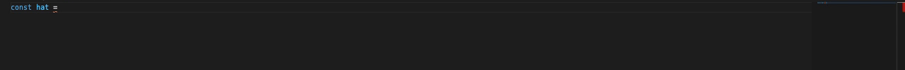

# fluid-scoretools

A collection of tools for expressively generating and modifying score string when writing pieces with [fluid-music](https://github.com/fluid-music/fluid-music) in VSCode (in progress).

## Features

At present, the tools included are:

* **Fluid-dSBSD**: Discounted stochastic binary subdivision. A simple algorithm for generating trap-like hi-hat rhythms, based on stochastic binary subdivision ([Langston 1988](http://citeseerx.ist.psu.edu/viewdoc/download?doi=10.1.1.91.3832&rep=rep1&type=pdf)). To invoke, enter `:dsbsd <duration> <character>:` e.g. `:dsbsd 128 t:`.
* **Fluid-halfTime**: Modifies a given score string to be double the duration by adding spaces and hyphens. E.g. `"tttt"` => `"t-t-t-t-"`. To invoke, enter `:halfTime:`.

